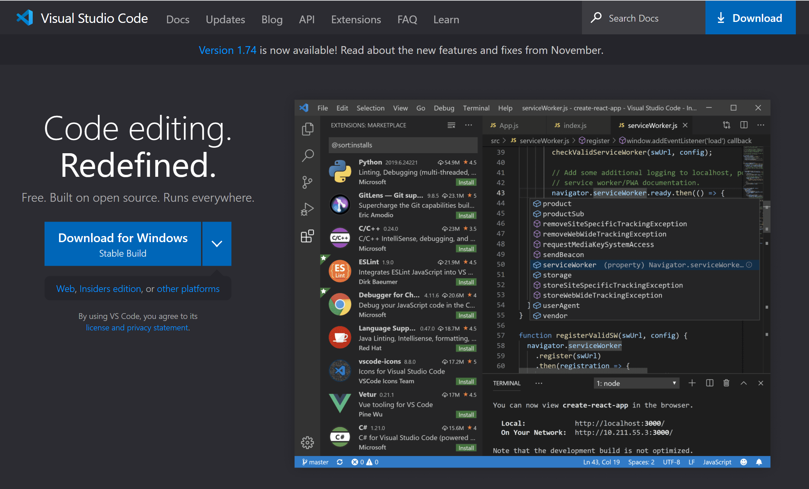

Lab Report 1: Remote Access and Filesystem
==========================================

Installing VScode
-----------------
Install VScode (Visual Studio Code) [here](https://code.visualstudio.com/). The page will look something like the image below.



Click on the box Download for Windows, or click the drop-down menu for IOS Systems.

Remotely Connecting
-------------------
Once you've downloaded VS code. Open VS code and press `Ctrl`/`command` + `+` to open the terminal. The window will look like this.


Now enter `ssh` followed by your account (ex. `cs15lwi23akm@ieng6.ucsd.edu`). Like this:


For connecting for the first time, you will see the following message:

```
The authenticity of host 'ieng6.ucsd.edu (128.54.70.238)' can't be established.
RSA key fingerprint is SHA256:ksruYwhnYH+sySHnHAtLUHngrPEyZTDl/1x99wUQcec.
This key is not known by any other names.
Are you sure you want to continue connecting (yes/no/[fingerprint])?
```

Type `yes`. Then it will ask you for your password. 


Enter your password (it will not display what you've entered as password, but you have entered it). The following will appear in the terminal once you've pressed `enter` after entering your password.


Now, you have connected to a computer in the lab and you are ready to enter commands to view/manipulate files on the lab computer!


Trying Some Commands
--------------------

Now that you have remote access, type in some commands view, swtich between or display files on the lab computer.

Some commands to try are:
* `cd`
* `cd ~ `
* `ls`
* `ls -lat`
* `pwd`

Below is an example of using the command `pwd` (which displays the current directory's path).


