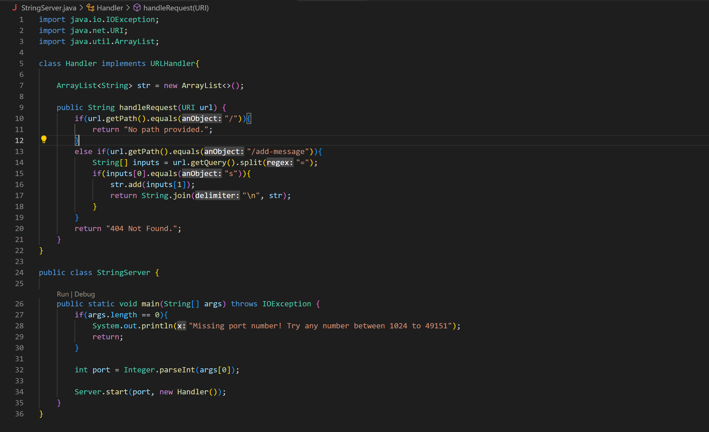
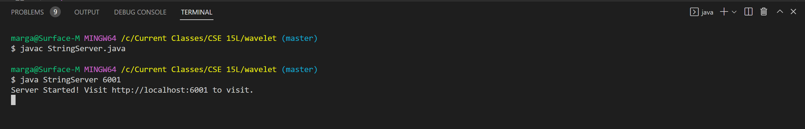
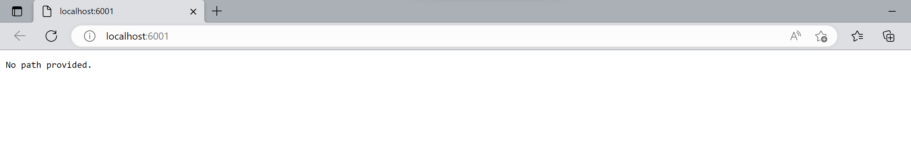
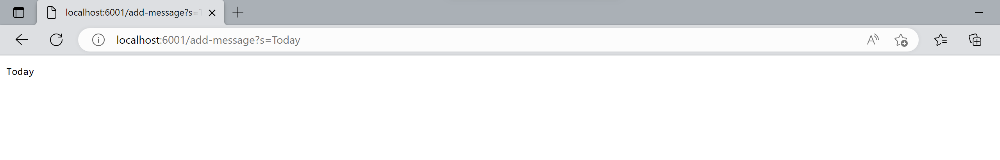
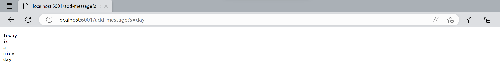
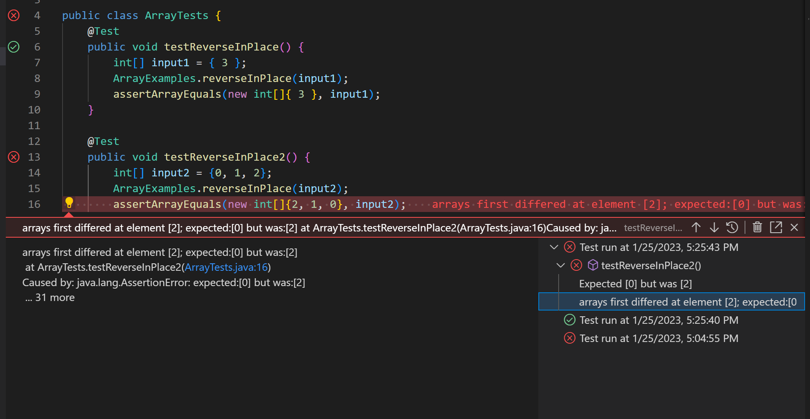

Lab Report 2
============

Part 1
------

Below is a screenshot of my `StringServer` class.



Here are some screenshots of me launching the web server and using the path `/add-message` to display messages on the server.




The sequence of the two screenshots of above shows me compiling and running `StringServer`. Java code always start in the main method. Since I provided a port number, the `if` statement evaluates to false, and the `if` block is skipped. Next, the `int` variable `port` is set to `6001`, and the `start` method in `Server` is called to create the web server and provide us with an accessible address. `port` (with value `6001`) and a new Handler object are passed in as parameter. 

The Handler method creates a new ArrayList object (that is currently empty). And because I have not provided it with a path, the `if` block is enter and the corresponding message is displayed.

Now I will give it a path:



Above, by providing a path, the `else if` condition is checked in `handleRequest`. It compares the path given with `/add-message`. In this example the result from the comparison would be true, entering the `else if` block.

In the `else if` block, it will first create a new array object and store the query (`s=Today`) in the array, splitting it into two elements by `=`. So element 0 is `s` and element 1 is `Today`.

After that, it checks that element 0 is `s`, which is also true here, so the input after `=` in the query (now stored as element 1 in the array) is then stored into an ArrayList that will get printed by the method.



In the screenshot above, you can see several lines of messages. Each time you type in a path, the input in the query sfter `s=` is stored as a new element in the ArrayList through the same process as described for the first message ("Today"). Then they are each printed in a seperate line and displayed on the web server.


Part 2
------

Below is the original bug-producing program.

```
static void reverseInPlace(int[] arr) {
    for(int i = 0; i < arr.length; i += 1) {
      arr[i] = arr[arr.length - i - 1];
    }
}
```

The above program is supposed to reverse the original array. The program returns the expected output with the following input:

```
int[] input1 = { 3 };
ArrayExamples.reverseInPlace(input1);
assertArrayEquals(new int[]{ 3 }, input1);
```

However, other test induec failures, like the code given below:

```
int[] input2 = {0, 1, 2};
ArrayExamples.reverseInPlace(input2);
assertArrayEquals(new int[]{2, 1, 0}, input2);
```

JUnit gives the folowing message when both blocks of code above is tested:



As you can see, only the second test results in an failed test.

The problem in the original bug-producing program is that the array is being updated as its data is still being referenced. So we need to create a temporary array and deep copy the original array's data over. Then reverse the order of the array by updating its indexs using data from the temporary array. 

Here's a comparison of the original bus-producing program (on the top) vs. the fixed program (on the bottom):

```
static void reverseInPlace(int[] arr) {
    for(int i = 0; i < arr.length; i += 1) {
      arr[i] = arr[arr.length - i - 1];
    }
}
```

```
static void reverseInPlace(int[] arr) {
    int[] tempArr = new int[arr.length];

    for(int i = 0; i < arr.length; i += 1) {
        tempArr[i] = arr[i];
    }

    for(int i = 0; i < arr.length; i += 1) {
      arr[i] = tempArr[arr.length - i - 1];
    }
}
```

In the fixed, program. We created `tempArr` to temporarily store the data while we modified `arr`. This way we are accessing the original array accurately and updating its indeices with the element we intended to update it with.


Part 3
------

Web server is a completely new concept to me. I've never accessed or played around with url the way we did in week 2's lab. From these activities, I learned about the meaning to different parts of the url and how it resembles folder paths on the local computer. Also, I realized that although they often look like non-sense scrambled letters in web urls, every part of the url are very significant and provide the program with crucial information.
