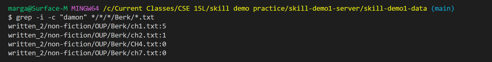

Lab Report 3: Researching Commands - `grep`
===========================================

We will look at 4 different options that can be used with the `grep` command: `-l`, `-f`, `-v`, and `-c`.

First, for context, the `grep` command is used as such:

`grep "PATTERN" *FILENAME*`

On its own, it returns all the lines that contains the specified pattern.

Now let's look at what happens when you follow `grep` with other options.

`-i`
----

`-i` ignores case of input pattern. 

Here, I typed in the names in lower-case, but it still recognized "Bob and Sharon" as matching pattern.

Here, I typed in the names in all caps, but it still recognized "Noah and Suzanne" as matching pattern. 

`-l`
----

Instead of the normal output (lines that contains the pattern), `-l` will print only the file name of the file that contains the pattern. In the background, each file is scanned and scanning stops as soon as first match is found.

Here, I gave it the pattern "Bahamas" and it returend only the file names of all files that contained the pattern and not each line.

Here is an example of using `-i` and `-l` together. By using `-i`, even though I typed "bahamas" wihtout capitalizing teh first letter, it still recognized "Bahamas" in each file and outputted them as files with matching pattern.

Here is just another example of using `-l`. It displayed file names of all the files that contains the pattern instead of each line.

`-c`
----

Instead of standard output, `-c` will output the number of times the pattern exists in a file. When used with `-l` it will output the file names followed by number of times the pattern appears in each file.

Above, I used `-c` on `Kauffeman/*.txt` so it outputted all the files that match that pattern for file name, followed by the count for the pattern `who` in each of them. 

Here, I specified the text file `ch1.txt` so now it only print a number that represents the count for the pattern, without repeating the file name.

Even though "Damon" is a name and shows up in the text files with a capitalized "D," here when we add `-i` and pass in "damon" and input pattern, "Damon" is also recognized as a match. 

`-v`
----

`-v` looks for lines that do ***not*** contain the pattern instead. Outputs lines without pattern. 

Here you can see there is a large space before the system outputs all the lines that does not contain "the." Actually the empty sapce also represents lines without "the" just the empty lines that are used to distinguish between paragrahps. Let's use `-v -c` to confirm:

Here you can see the output indicates there are 13 lines with out "the." But with can only see 5 lines above, which means there are 8 empty lines that also do not contain "the" that were printed.

As predicted, if we use `-i -v` the last line which had "The" is now also considered a match pattern (as we ignore the case). Therefore it is no longer an output of the new command.

Source/Reference: [grep_manual](https://man7.org/linux/man-pages/man1/grep.1.html)
