Lab Report 3: Researching Commands - `grep`
===========================================

We will look at 4 different options that can be used with the `grep` command: `-i`, `-l`, `-c`, and `-v`.

First, for context, the `grep` command is used in the following format:

`grep "PATTERN" *FILENAME*`

On its own, it returns all the lines in a file that contains the specified pattern.

Now let's look at what happens when you follow `grep` with other options.

`-i`
----

`-i` ignores case of input pattern. 

Example 1:

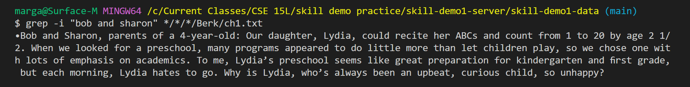

Here, since `-i` ignore the case of input pattern, even though I typed in the names in lower-case, it still recognized "Bob and Sharon" as matching pattern.

Example 2: 

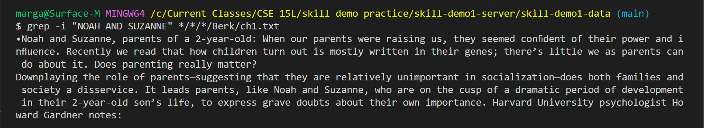

Similar the previous example, case is ignored, so even though the pattern is given in all caps, "Noah and Suzanne" is still recognized as matching pattern. 

`-l`
----

Instead of the normal output (lines that contains the pattern), `-l` will print only the file name of the file that contains the pattern. In the background, each file is scanned and scanning stops as soon as first match is found.

Exmaple 1:

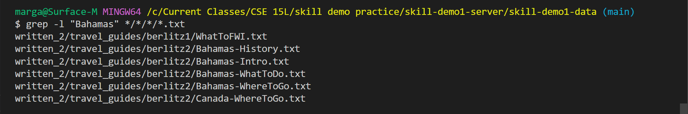

Here, I gave it the pattern "Bahamas" and used `*` so that it scans all text files in the third layer of directory under `skills-demo1-data`. With this command, it returend only the file names of all files that contained the pattern and not each line.

Example 2:

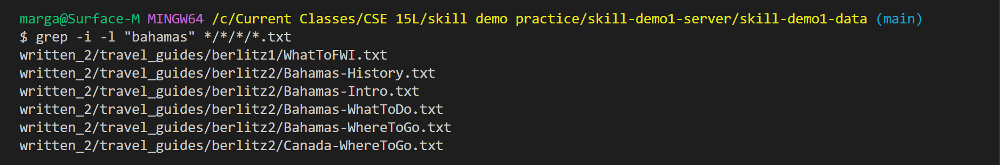

Here is an example of using `-i` and `-l` together. By using `-i`, even though I typed "bahamas" wihtout capitalizing teh first letter, it still recognized "Bahamas" in each file and outputted them as files with matching pattern.

Example 3:

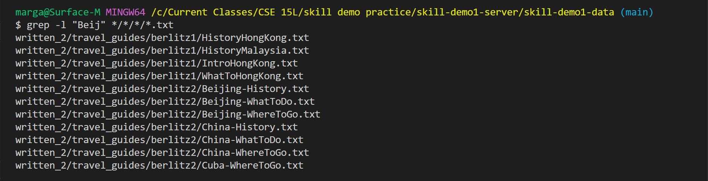

Here is just another example of using `-l`. It displayed file names of all the files that contains the pattern instead of each line. You can see the pattern does not have to be a word (that would be followed by a space) but can also be part of a word.

`-c`
----

Instead of standard output, `-c` will output a count: the number of times the pattern exists in a file. If more than one file is scanned, it outputs the file name followed by a count for the number of times the pattern appears in the file.

Example 1:

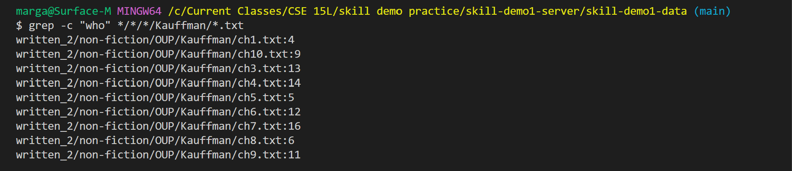

Above, I used `-c` on `Kauffeman/*.txt` so it outputted all the files that match that pattern for file name followed by the count for the pattern `who` in each file. 

Example 2:

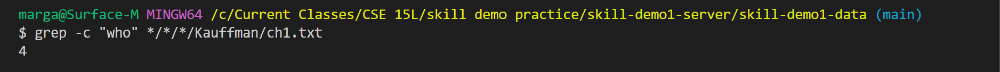

Here, I specified the text file `ch1.txt` so now it only print a number that represents the count for the pattern, without repeating the file name.

Example 3:

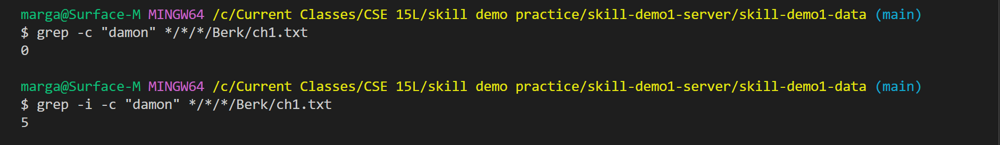

Here I used `-c` alone and then with `-i` on the pattern "damon". From the result of the first `grep` we can see that the pattern "damon" doesn't actually exist in the text file (count returned is `0`). But if we add `-i,` although "Damon" is a name and shows up in the text files with a capitalized "D," "damon" is now also recognized as a match, and we can see that the name appears 5 times in the text. 

`-v`
----

`-v` looks for lines that do ***not*** contain the pattern instead. Outputs lines without pattern. 

Example 1:

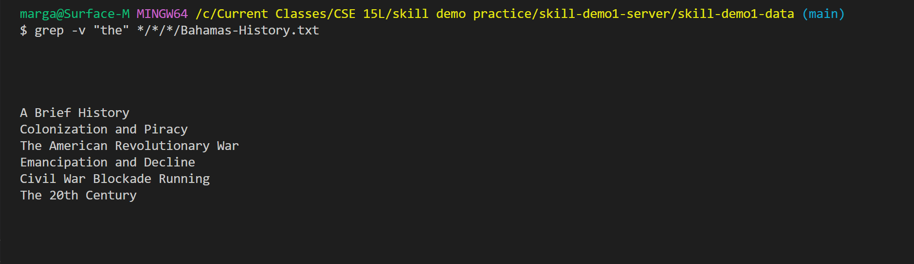

Here you can see there is a large space before the system outputs all the lines that does not contain "the". Actually the empty space are also representative of lines without "the", they are just literally the empty lines that are used to distinguish between paragrahps. Let's use `-v -c` to confirm:

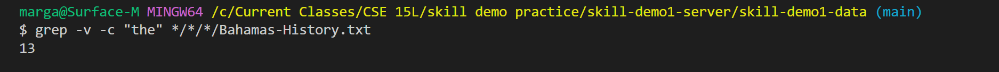

Here you can see the output indicates there are 13 lines with out "the", but we can only see 5 lines above, which means there are 8 empty lines that also do not contain "the" that were printed.

Example 2:

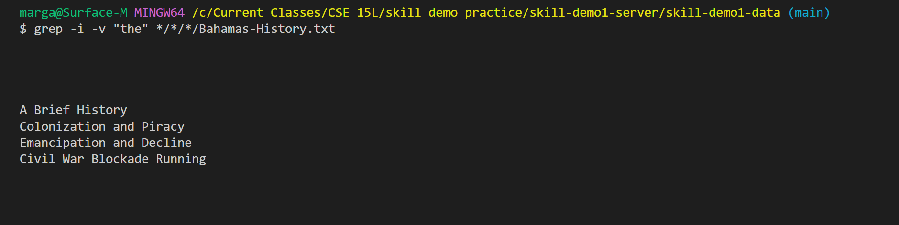

As expected, if we use `-i -v`, the last line which contains "The" is now also considered a match pattern (as we ignore the case). Therefore it is no longer an output of the new command as `-v` outputs all lines *not* containing the pattern.

Source/Reference: [grep_manual](https://man7.org/linux/man-pages/man1/grep.1.html)
