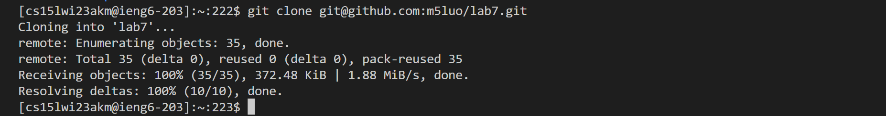

Lab Report 4: Lab Tesks Step by Step
-------------------------------------

In this report, I will walk through each step I took to complete the week seven lab task. 

First, below is a summarized list of all the tasks involved. 

Tasks:
1. Fork the lab7 repository
2. Log into ieng6
3. Clone your fork of the repository from your Github account
4. Run the tests, demonstrating that they fail
5. Edit the code file to fix the failing test
6. Run the tests, demonstrating that they now succeed
7. Commit with a commit message, then push the resulting change to your Github account

Let's dive in to each task step by step:

Fork the lab7 repository
------------------------

For this step, you simply open the hyperlinked "lab7" from the course website, and fork it with the button on the top left!

Log into ieng6
--------------

1. Typed `ssh` <`space`> followed by my ieng6 login: `cs15lwi23akm@ieng6.ucsd.edu`.
2. Since I previously set up my account, it automatically connected remotely without needing me to type in my password.

Clone your fork of the repository
---------------------------------

1. I went to the forked repository on the github webpage.
2. Clicked on the green drop-down menu labeled "Code"

3. Switched to the "SSH" tab, and copied the link (by clicking on the overlapping squares button on the right).
4. I went back to my terminal and typed `git clone` followed by <`space`> and <`Ctrl`><`v`> (which pasted the url to the terminal).
5. Pressed <`Enter`>.

As you can see, I have now cloned the repository onto my ieng6 machine.

Running the tests
-----------------

1. I typed `ls` then <`Enter`> to check that "lab7" now exists as a directory in my ieng6 home directory.
2. Typed `cd lab7` then <`Enter`> to change into the lab7 directory.
3. `ls` again to see what files exist inside the directory.

4. Using <`Ctrl`><`C`>, I copied the code to compile JUnit test from course webpage week 3 (`javac -cp .:lib/hamcrest-core-1.3.jar:lib/junit-4.13.2.jar *.java`).
5. Pasted using <`Ctrl`><`V`>, then <`Enter`> to compile java files inside lab7.
6. Used <`Ctrl`><`C`> again to copy the command to run `TestListExamples` (`java -cp .:lib/hamcrest-core-1.3.jar:lib/junit-4.13.2.jar org.junit.runner.JUnitCore`).
7. <`Ctrl`><`V`> again to paste onto the terminal, then typed `TestListExamples` and <`Enter`>

Here, you can see that one test failed.

Edit the code file
------------------

1. To edit code file, I typed `nano L`, then <`Tab`>, which autofilled `ListExamples.`, then I just typed `java` and <`Enter`>.
2. Pressed <`Ctrl`><`W`> to search, then typed `merge` and <`Enter`> (as that is the method the test files tested). 
3. My cursor was moved down to the first "merge" in the file. Next I pressed the <`down`> 19 times and <`left`> 6 times to reach where the bug is.
4. I pressed <`Backspace`> to delete "1" and typed `2` to fix the bug.
5. I pressed <`Ctrl`><`O`> and <`Enter`> to save my edits, then <`Ctrl`><`X`> to exit nano.

Run again
---------

1. Since the compiling and running commands are now in my search history, I pressed <`up`> 3 times and <`Enter`> to compile
2. Similarly, I pressed <`up`> 3 times and <`Enter`> again to run.

As you can see, the tests all passed now.

Commit with message and push
----------------------------

1. I typed `git add ListExamples.java` (since that is the file that was edited/updated) then <`Enter`>.
2. Then I typed `git commit -m "ListExamples.java updated"` and <`Enter`> to commited my edits.
3. Next I typed `git push` and <`Enter`> to update my git repository.

As you can see, ListExamples.java in my github is now also updated.

