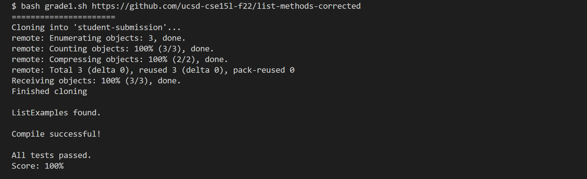
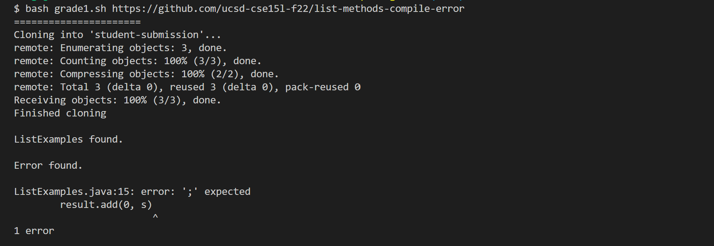

Lab Report 5: Grading Script
============================

Here is the link to my grading bash script: [grader](grade1.sh).

A little summary of the code:
The bash script takes in a directory that contains a java file called ListExamples.java. It checks the folowing before running a tester: the file with the right name is found, it compiles successfully, has a matching method signature (so the tester will be able to call the method). If all the previous steps proceed succesfully, the tester will be run to see if the code passes the test. If a process fails, it prints out the message generated by java or JUnit and exit immediately.

I tested this grading script on all the examples java files given on the course website. Below are detailed outputs of the sciprt given each java file.

1. File from Lab 3
Expect behavior:
- File: Found.
- Compile: Successful.
- Method Signature: Match.
- Test: Fail as the third `while` loop in the code is supposed to iterate through list 2 but updates the index of list 1.

Screenshot of the actual test run:

2. Corrected File
Expect behavior:
- File: Found.
- Compile: Successful.
- Method Signature: Match.
- Test: Pass since the issue that failed the first file is fixed.

Screenshot of the actual test run:

3. File with Compile Error
- File: Found.
- Compile: Failed due to syntax error: missing semi-colon on line 15.
- Method Signature: Not applicatble as bash script exists as soon as compilation fails.
- Test: Not applicatble as bash script exists as soon as compilation fails.

Screenshot of the actual test run:

4. Different Method Signature
- File: Found
- Compile: Successful
- Method Signature: Does not match the expected method signature as the parameters were switched.
- Test: Not applicable as bash script exists as soon as method signature did not match.

Screenshot of the actual test run:

5. Different Filename
- File: Not found as filename does not match expected.
- Compile: Not applicable as bas script exists as soon as file is not found.
- Method Signature: Not applicable as bas script exists as soon as file is not found.
- Test: Not applicable as bas script exists as soon as file is not found.

Screenshot of the actual test run:

6. File Nested Inside Another Directory
- File: Not found as file is nested inside another directory.
- Compile: Not applicable as bas script exists as soon as file is not found.
- Method Signature: Not applicable as bas script exists as soon as file is not found.
- Test: Not applicable as bas script exists as soon as file is not found.

Screenshot of the actual test run:

